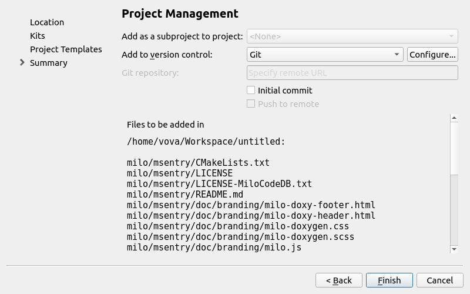
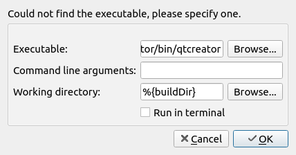
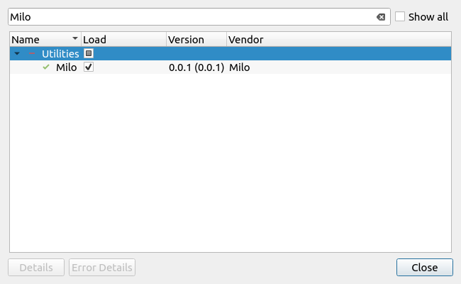

# Milo plugin for the Qt Creator IDE

## Overview

This plugin contains custom page for the Qt Creator wizard which can be added by specifying it in the *pages* section of a wizard.json file.

The page has the *typeId* value *MiloSummary* and extends predefined *Summary* page by few additional widgets and git operations.



By using additional git operations on this page you can:

* make initial commit
* add specified repository URL to remote
* push to remote

As *Summary* page *MiloSummary* page also contains no data or an empty object.
```
    {                                         
        "trDisplayName": "Project Management",
        "trShortTitle": "Summary",
        "typeId": "MiloSummary"
    }
```

The page also sets *IsSubproject* to an empty string if this is a toplevel project and to *yes* otherwise. It sets *VersionControl* to the ID of the version control system in use.

## Building the Plugin

To build the plugin you need to specify the **Qt Creator sources** directory and the **Qt Creator build** directory of the Qt Creator instance you want to use to test the plugin. You can specify this paths in the *plugin-src/milo.pro* file, just find following lines and edit them accordingly:
```
    . . .
    isEmpty(IDE_SOURCE_TREE): IDE_SOURCE_TREE = "../dependencies/src/qt-creator"
    . . .

    . . .
    isEmpty(IDE_BUILD_TREE): IDE_BUILD_TREE = "../dependencies/build/QtCreator"
    . . .
```

Presently, for fetching fresh versions of the Qt Creator, I use the oficial sources from the [GitHub](https://github.com/qt-creator/qt-creator.git) as submodule in */dependencies/src/qt-creator* directory. So, you can clone the Milo plugin repository by using *--recursive* option:
```
    git clone --recursive https://github.com/VMironiuk/milo-qtcreator-plugin.git
```

If you passed the correct Qt Creator sources and build paths in the *plugin-src/milo.pro* file, the plugin should just build fine when pressing the build button.

## Running the Plugin

When you try to run the plugin project, Qt Creator will ask you for the executable to run and you are presented the following dialog:



Select the path to the Qt Creator executable from the build that you specified in the *plugin-src/milo.pro* file and click **OK**. Qt Creator starts up, and you can verify that the plugin successfully loaded by looking for the plugin in the **About Plugins** dialog.



Reference: [Extending Qt Creator Manual | Creating Your First Plugin](https://doc-snapshots.qt.io/qtcreator-extending/first-plugin.html)